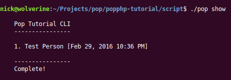
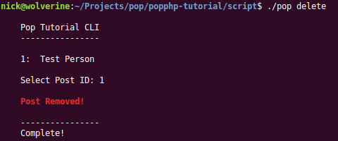

Working with the Console App
============================

The CLI side of the application is set up to demonstrate how one would program and interact
with an application via the console. From a user perspective, running the following commands
will trigger certain actions.

To show the help screen:

.. code-block:: bash

    script/pop help

.. image:: images/pop-cli1.png

To show the current posts:

.. code-block:: bash

    script/pop show

To delete a post:

.. code-block:: bash

    script/pop delete

Script File
~~~~~~~~~~~

A closer look at the application code in the main ``public/index.php`` file and you'll see:

.. code-block:: php

    #!/usr/bin/php
    <?php

    require_once __DIR__  . '/../vendor/autoload.php';

    $app = new Tutorial\Application(
        include __DIR__ . '/../app/config/application.console.php'
    );

    $app->run();

Application Object
~~~~~~~~~~~~~~~~~~

In the above file, the shell environment is set to PHP. And like the web index file, this script file
loads the Composer autoloader, and the new application object is created, passing the console application
configuration file into the application object. From there, the ``run()`` method is called and the
console application is routed and on its way.

If you take a look at the ``app/config/application.console.php`` file, you'll see the console routes,
as well as the database service, are defined in the file. The routes are automatically passed and wired
up to a router object and the main application sets the database object that is to be used from the
service. If you look insde the ``Tutorial\Application`` class, you see the lines:

.. code-block:: php

    $this->on('app.init', function($application){
        Record::setDb($application->services['database']);
    });

Once those lines of code are executed upon the ``app.init`` event trigger, the database becomes available
to the rest of the application. Furthermore, you'll see a CLI specific header and footer that is only
triggered if the environment is on the console.

ConsoleController
~~~~~~~~~~~~~~~~~

Looking at the main ``ConsoleController`` class in the ``app/src/Controller/`` folder, you will see the
various method actions that serve as the route end points. Within the constructor of the controller,
a few object properties are wired up that will be needed, such at the console object and the help
command. Within the ``help`` method, you can see a basic call to display the help text in the console.
The ``show`` method accesses the model to retrieve the data to display the posts in the console. The
``delete`` method handles a more complex transaction, triggering a prompt for the user to enter the
selected post ID to delete.
