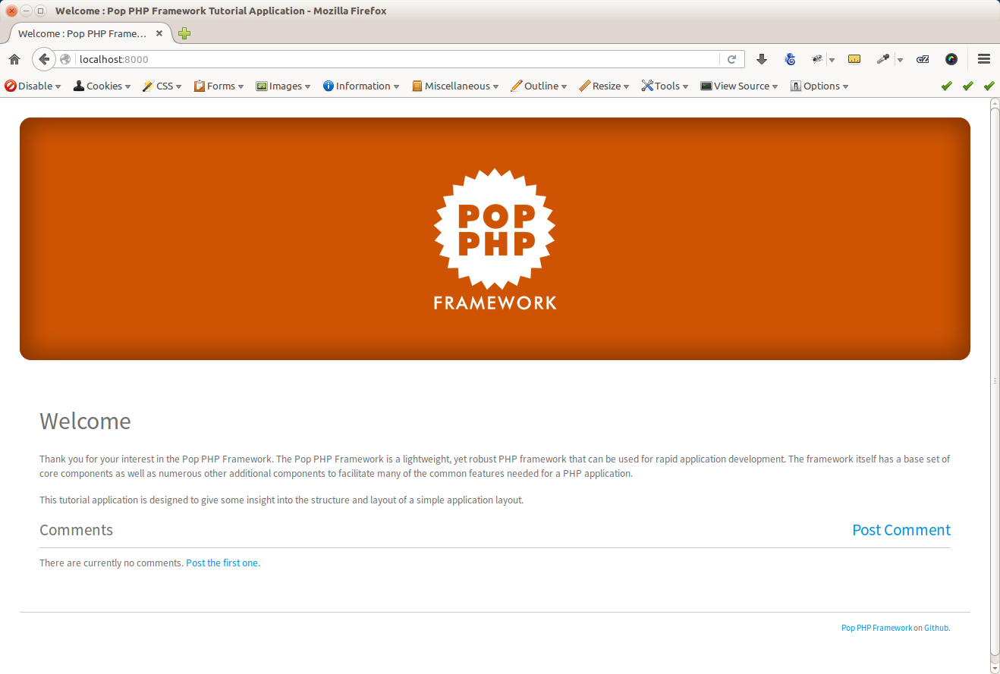
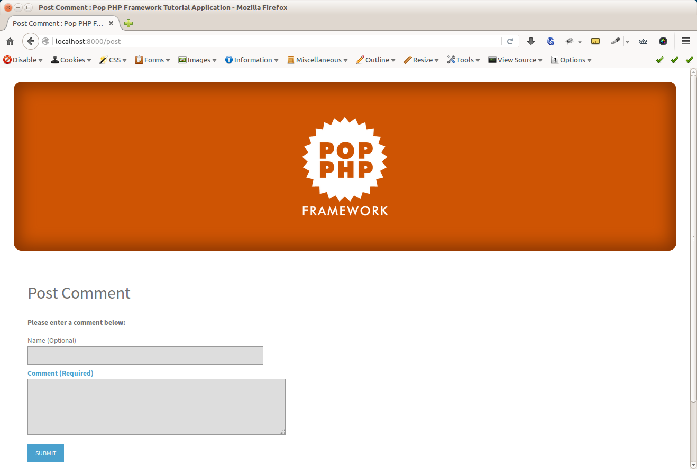
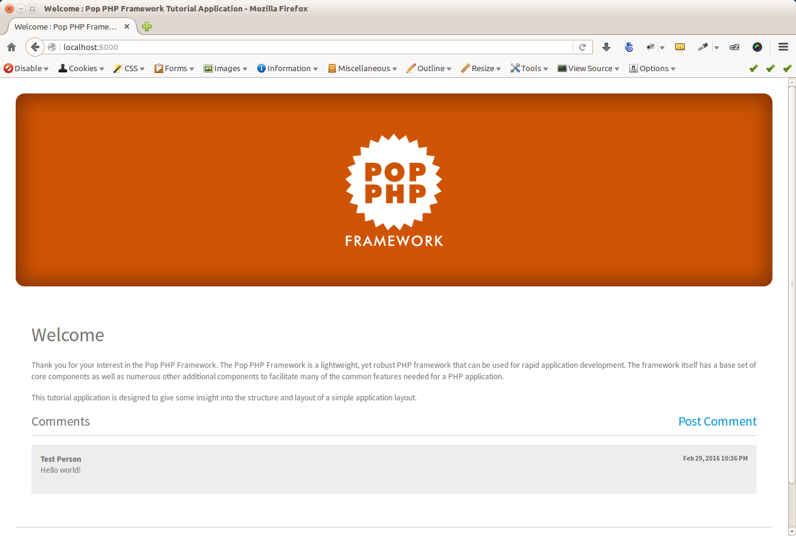

Working with the Web App
========================

Once you have the web application up and running, you should be able to see the Pop welcome screen
in your browser:

From the user perspective, you can click on the `post` link to view the post comment form:

Once you successfully fill out the post comment form, you are redirected back to the home page, where
you can see the new post is now displayed in the feed of posts at the bottom of the page:

Index File
~~~~~~~~~~

A closer look at the application code in the main ``public/index.php`` file and you'll see:

.. code-block:: php

    <?php

    require_once __DIR__  . '/../vendor/autoload.php';

    // Create the app, loading the config file
    $app = new Tutorial\Application(
        include __DIR__ . '/../app/config/application.web.php'
    );

    // Run the app
    $app->run();

In the above file, the Composer autoloader is loaded up, and the new application object is created,
passing the web application configuration file into the application object. From there, the ``run()``
method is called and the web application is routed and on its way.

Application Object
~~~~~~~~~~~~~~~~~~

If you take a look at the ``app/config/application.web.php`` file, you'll see the web routes, as well
as the database service, are defined in the file. The routes are automatically passed and wired up
to a router object and the main application sets the database object that is to be used from the
service. If you look insde the ``Tutorial\Application`` class, you see the lines:

.. code-block:: php

    $this->on('app.init', function($application){
        Record::setDb($application->services['database']);
    });

Once those lines of code are executed upon the ``app.init`` event trigger, the database becomes available
to the rest of the application.

IndexController
~~~~~~~~~~~~~~~

Looking at the main ``IndexController`` class in the ``app/src/Controller`` folder, you will see the
various method actions that serve as the route end points. Within the constructor of the controller,
a few object properties are wired up that will be needed, such at the request and response objects and
the view path. Within the ``index`` method, you can see a basic call the model, and the setting of
data in the view to be displayed in the browser. The ``post`` method handles a more complex transaction,
testing for POST, and validating the form and passing the form data to the model object upon a
successful validation.

