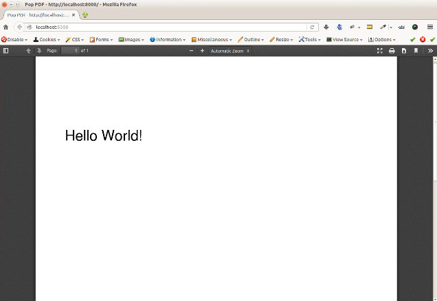

PDFs
====

PDF generation in a web application is typically a required feature for any application that
does any type of in-depth reporting or data exporting. Many applications may require this
exported data to be in a concise, well-formatted and portable document and PDF provides this.

The PDF specification, as well as its shared assets' specifications, such as fonts and images,
are an extremely large and vast set. This component attempts to harness the power and features
defined by those specifications and present an intuitive API that puts the power of PDF at
your fingertips.

Building a PDF
--------------

At the center of the `popphp/pop-pdf` component is the main ``Pop\Pdf\Pdf`` class. It serves
as a manager or controller of sorts for all of the various PDF assets that will pass through
during the process of PDF generation. The different assets are each outlined with their own
section below.

Here's a simple example building and generating a PDF document with some text. The finer points
of what's happening will be explained more in depth in the later sections.

.. code-block:: php

    use Pop\Pdf\Pdf;
    use Pop\Pdf\Document;
    use Pop\Pdf\Document\Font;
    use Pop\Pdf\Document\Page;

    // Create a page and add the text to it
    $page = new Page(Page::LETTER);
    $page->addText(new Page\Text('Hello World!', 24), Font::ARIAL, 50, 650);

    // Create a document, add the font to it and then the page
    $document = new Document();
    $document->addFont(new Font(Font::ARIAL));
    $document->addPage($page);

    // Pass the document to the Pdf object to build it and output it to HTTP
    $pdf = new Pdf();
    $pdf->outputToHttp($document);

Importing a PDF
---------------

Documents
---------

Fonts
~~~~~

Forms
~~~~~

Pages
-----

Images
~~~~~~

Color
~~~~~

Paths
~~~~~

Text
~~~~

Annotations
~~~~~~~~~~~

Fields
~~~~~~
